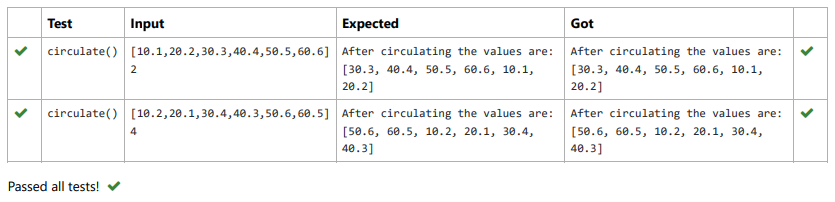

# Circulate-the-values-of-N-variables
## Aim:
To write a python program to circulate the n variables using function concept
## Equipment’s required:
PC
Anaconda - Python 3.7
## Algorithm: 
### Step 1: 
first step is to degine the function
### Step 2: 
get a,n inputs from the user
### Step 3: 
define the formula steps
### Step 4: 
print the result


## Program:

```python
#Program to circulate N values.
#Developed by: Ashwin kumar.S
#RegisterNumber:22000974

def circulate():
    a=eval(input())
    n=int(input())
    c=a[n:]+a[:n]
    print("After circulating the values are:",c)

```

## Output:


## Result:
By this program we able to circulate the value of n_variables